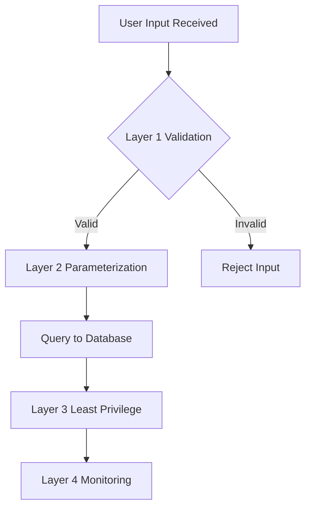

# 01 - Introduction to SQL Injection

## Overview

SQL injection (SQLi) is one of the most critical web application vulnerabilities. It allows attackers to interfere with the queries that an application makes to its database, potentially accessing sensitive data, modifying database contents, or even executing administrative operations on the database server.

This chapter covers the fundamental concepts you need before diving into exploitation techniques covered in later chapters.

## What Is SQL Injection?

SQL injection is a code injection attack where an attacker inserts malicious SQL statements into input fields, which are then executed by the database server. This occurs when user input is concatenated into SQL queries without proper sanitization or parameterization.

### The Core Problem

Consider this vulnerable PHP code:

```php
// Vulnerable authentication code
$username = $_GET['username'];
$password = $_GET['password'];

$query = "SELECT * FROM users WHERE username = '$username' AND password = '$password'";
$result = mysqli_query($conn, $query);

if (mysqli_num_rows($result) > 0) {
    // User authenticated
    login_success();
}
```

**Normal Input:**

- Username: `admin`
- Password: `secret123`
- Query: `SELECT * FROM users WHERE username = 'admin' AND password = 'secret123'`

**Malicious Input:**

- Username: `admin' --`
- Password: `anything`
- Query: `SELECT * FROM users WHERE username = 'admin' --' AND password = 'anything'`
- Result: The `--` comments out the password check, allowing login without valid credentials

## Types of SQL Injection

Understanding the different types helps you choose the right exploitation technique:

| Type                   | Description                                        | Detection Method                 | Covered In                                             |
| ---------------------- | -------------------------------------------------- | -------------------------------- | ------------------------------------------------------ |
| **In-band (Classic)**  | Results displayed directly in application response | Visible output, errors           | [04-Union-Injection.md](04-Union-Injection.md)         |
| **Error-based**        | Database error messages reveal information         | Error messages                   | [03-Basic-Exploitation.md](03-Basic-Exploitation.md)   |
| **Union-based**        | Uses UNION operator to extract data                | Visible output with crafted data | [04-Union-Injection.md](04-Union-Injection.md)         |
| **Blind (Boolean)**    | True/false questions based on page differences     | Page content comparison          | [05-Blind-Injection.md](05-Blind-Injection.md)         |
| **Blind (Time-based)** | Uses time delays as boolean indicator              | Response timing analysis         | [05-Blind-Injection.md](05-Blind-Injection.md)         |
| **Out-of-band**        | Results sent via different channel (DNS, HTTP)     | External interactions            | [05-Blind-Injection.md](05-Blind-Injection.md)         |
| **Stacked queries**    | Multiple SQL statements executed                   | Multiple statement support       | [10-Advanced-Techniques.md](10-Advanced-Techniques.md) |

## Why SQL Injection Still Exists

Despite being well-known since 1998, SQL injection remains prevalent because:

1. **Legacy Code**: Many applications were built before secure coding practices were common
2. **Developer Education**: Not all developers understand secure coding patterns
3. **Complex Applications**: Large codebases make it hard to audit every query
4. **Third-Party Code**: Libraries and components may have vulnerabilities
5. **False Confidence**: WAFs and filters give a false sense of security

## Common Injection Points

Attackers can inject SQL code through various input vectors:

### URL Parameters

```
https://site.com/product?id=1'           -- Product ID parameter
https://site.com/search?q=test'          -- Search query
https://site.com/page?id=1&cat=2'        -- Multiple parameters
```

### POST Form Fields

```html
<!-- Login forms -->
<input name="username" value="admin'--" />
<input name="password" value="anything" />

<!-- Search forms -->
<input name="search" value="laptop' UNION SELECT * FROM users--" />

<!-- Registration forms -->
<input name="email" value="test@test.com' OR '1'='1" />
```

### HTTP Headers

```http
User-Agent: ' OR 1=1--
X-Forwarded-For: 127.0.0.1' UNION SELECT * FROM users--
Referer: https://site.com' AND 1=1--
Cookie: session=abc123' AND (SELECT * FROM users)--
```

### API Endpoints (JSON/XML)

```json
{
  "username": "admin'--",
  "password": "test"
}

{
  "filters": {
    "category": "laptop' OR '1'='1"
  }
}
```

### File Metadata

```http
Content-Type: image/jpeg; name="photo.jpg' UNION SELECT * FROM users--"
X-File-Name: document.pdf' AND 1=1--
```

## Basic Payload Structure

### Comment Syntax Reference

Different databases support different comment styles:

| Database   | Single-line Comments        | Multi-line Comments |
| ---------- | --------------------------- | ------------------- |
| MySQL      | `-- ` (space required), `#` | `/* comment */`     |
| PostgreSQL | `-- `                       | `/* comment */`     |
| MSSQL      | `-- `                       | `/* comment */`     |
| Oracle     | `-- `                       | `/* comment */`     |
| SQLite     | `-- `                       | `/* comment */`     |

**Important**: The space after `--` is required in MySQL for the comment to work.

### Quote Characters

| Character | Usage           | Notes                        |
| --------- | --------------- | ---------------------------- |
| `'`       | Single quote    | Most common string delimiter |
| `"`       | Double quote    | Alternative string delimiter |
| `         | Backtick        | MySQL identifier quoting     |
| `[]`      | Square brackets | MSSQL identifier quoting     |

## Your First SQL Injection Test

### Step 1: Error-Based Detection

The simplest test is injecting a single quote to break the query syntax:

```
Normal:  https://site.com/user?id=1
Test:    https://site.com/user?id=1'
```

**Expected vulnerable response:**

```
Error: You have an error in your SQL syntax;
check the manual that corresponds to your
MySQL server version for the right syntax
to use near ''' at line 1
```

This error confirms:

- The input is directly used in a SQL query
- The database is MySQL
- The application doesn't properly handle errors

### Step 2: Boolean Logic Confirmation

After detecting a potential injection point, confirm it with boolean logic:

```
Test 1: id=1' AND '1'='1    → Should return normal result (true)
Test 2: id=1' AND '1'='2    → Should return different result (false)
```

**Why this works:**

- `AND '1'='1'` is always true, so the query executes normally
- `AND '1'='2'` is always false, so the query returns no results
- Different responses confirm injectable parameter

### Step 3: Determine Column Count

Before using UNION-based extraction, determine how many columns the original query returns:

```
ORDER BY 1--     (works)
ORDER BY 2--     (works)
ORDER BY 3--     (works)
ORDER BY 4--     (error)  ← Query has 3 columns
```

Alternative method:

```
UNION SELECT NULL--              (error)
UNION SELECT NULL,NULL--         (error)
UNION SELECT NULL,NULL,NULL--    (works) ← 3 columns
```

## Real-World Impact

### Data Breach Examples

SQL injection has caused major data breaches:

| Year | Target              | Records Exposed | Attack Vector                           |
| ---- | ------------------- | --------------- | --------------------------------------- |
| 2008 | Heartland Payment   | 130M+           | SQLi in payment processing              |
| 2011 | Sony Pictures       | 1M+             | SQLi in authentication system           |
| 2015 | TalkTalk            | 157K            | SQLi in website                         |
| 2016 | Adult Friend Finder | 412M            | SQLi in multiple databases              |
| 2017 | Equifax             | 143M            | Multiple vulnerabilities including SQLi |

### Potential Consequences

A successful SQL injection attack can lead to:

1. **Data Theft**: User credentials, personal information, financial data
2. **Data Modification**: Alter account balances, modify records
3. **Data Deletion**: Drop tables or entire databases
4. **Authentication Bypass**: Login as any user including administrators
5. **Remote Code Execution**: Execute operating system commands
6. **Lateral Movement**: Access other systems via database connections

## Prevention Methods

Understanding prevention helps you understand what defenses you may encounter:

### 1. Parameterized Queries (Prepared Statements)

**PHP (PDO):**

```php
$stmt = $pdo->prepare('SELECT * FROM users WHERE id = ?');
$stmt->execute([$user_id]);
```

**Python (psycopg2):**

```python
cursor.execute("SELECT * FROM users WHERE id = %s", (user_id,))
```

**Java (JDBC):**

```java
PreparedStatement stmt = conn.prepareStatement(
    "SELECT * FROM users WHERE id = ?"
);
stmt.setInt(1, userId);
```

**Node.js (pg):**

```javascript
const result = await pool.query('SELECT * FROM users WHERE id = $1', [userId])
```

### 2. Input Validation

```python
# Whitelist approach - only allow expected formats
import re

def validate_id(user_id):
    if not re.match(r'^\d+$', user_id):
        raise ValueError("ID must be numeric")
    return int(user_id)

def validate_email(email):
    pattern = r'^[a-zA-Z0-9._%+-]+@[a-zA-Z0-9.-]+\.[a-zA-Z]{2,}$'
    if not re.match(pattern, email):
        raise ValueError("Invalid email format")
    return email
```

### 3. ORM Usage

```python
# Django ORM (safe by default)
user = User.objects.get(id=user_id)

# SQLAlchemy ORM
user = session.query(User).filter_by(id=user_id).first()
```

### 4. Least Privilege

Database users should have minimal permissions:

- Application user: SELECT, INSERT, UPDATE only on necessary tables
- No DROP, ALTER, or administrative privileges
- Separate read-only and read-write accounts

## Defense Strategy Flowchart

### When to Use Each Defense Layer



**Defense Layers:**

| Layer                   | Purpose                   | Why This Layer                     |
| ----------------------- | ------------------------- | ---------------------------------- |
| **1. Validation**       | Whitelist expected format | First line, cheap and fast         |
| **2. Parameterization** | Prepared statements       | Most effective technical control   |
| **3. Least Privilege**  | Restrict DB permissions   | Damage control if injection occurs |
| **4. Monitoring**       | Log and alert             | Detection when prevention fails    |

**Reasoning for layered defense:**

1. **Validation First** - Cheapest to implement, catches obvious attacks before processing
2. **Parameterization** - Most effective technical control, separates code from data
3. **Least Privilege** - Damage control if injection occurs, limits blast radius
4. **Monitoring** - Detection and response when prevention fails

### Error Handling Best Practices

**Never expose database errors to users:**

```php
// BAD - Reveals database structure
$result = mysqli_query($conn, $query);
if (!$result) {
    echo "Error: " . mysqli_error($conn);  // DON'T DO THIS
}

// GOOD - Generic error, log details internally
$result = mysqli_query($conn, $query);
if (!$result) {
    error_log("Database error: " . mysqli_error($conn));  // Log internally
    echo "An error occurred. Please try again later.";    // Generic user message
}
```

**Why this matters:** Error messages reveal:

- Database type (MySQL, PostgreSQL, MSSQL)
- Query structure and table names
- Column names from "unknown column" errors
- File paths from error traces

## Practice Exercises

### Exercise 1: Identify Injection Points

Analyze these URLs and identify which are potentially vulnerable to SQL injection:

```
A) https://site.com/product?id=123
B) https://site.com/static/image.jpg
C) https://site.com/api/v1/users/456
D) https://site.com/search?q=laptop
E) https://site.com/contact (form submission)
```

**Answers:**

- A: Yes - Dynamic content based on ID
- B: No - Static file, no database query
- C: Yes - API endpoint with parameter
- D: Yes - Search functionality
- E: Yes - Form data often stored in database

### Exercise 2: Fix Vulnerable Code

This code is vulnerable. Rewrite it securely:

```php
// Vulnerable
$id = $_GET['id'];
$query = "SELECT * FROM products WHERE id = $id";
$result = mysqli_query($conn, $query);
```

**Secure version:**

```php
// Secure with prepared statement
$stmt = $conn->prepare("SELECT * FROM products WHERE id = ?");
$stmt->bind_param("i", $_GET['id']);
$stmt->execute();
$result = $stmt->get_result();
```

### Exercise 3: Test Comment Variations

Try these different comment styles to see which work:

```
1. id=1'--            (MySQL, MSSQL, Oracle, PostgreSQL)
2. id=1'-- -          (MySQL with required space)
3. id=1'#             (MySQL only)
4. id=1'/*comment*/   (Universal)
5. id=1';--           (MSSQL, PostgreSQL - stacked query attempt)
```

### Exercise 4: Understanding Context

Determine what each payload does:

```sql
-- Payload 1
' OR '1'='1'--

-- Payload 2
' UNION SELECT * FROM users--

-- Payload 3
'; DROP TABLE users;--

-- Payload 4
' AND 1=1--
```

**Answers:**

1. Always true condition - bypasses authentication or returns all records
2. Attempts to union user table data with current query
3. Stacked query attempting to delete the users table (MSSQL/PostgreSQL)
4. Boolean test - should return same result as original query

## Key Takeaways

1. **SQL injection occurs when user input is concatenated into SQL queries** without proper sanitization
2. **Single quote (`'`) is your best friend** - it's the most basic and effective test
3. **Comments (`--`, `#`) allow you to truncate** the rest of the original query
4. **Different databases have different syntax** - identification is crucial for successful exploitation
5. **Always follow the methodology**: Detect → Identify → Exploit → Extract
6. **Practice on isolated lab environments** - never test on production systems

## Next Steps

Now that you understand the fundamentals:

1. Continue to [02-Detection-Methods.md](02-Detection-Methods.md) to learn systematic detection approaches
2. Set up a practice lab using DVWA or similar
3. Test the basic payloads from this chapter
4. Keep notes on which techniques work against different defenses

Remember: The key to mastering SQL injection is **consistent practice** in safe, authorized environments.
